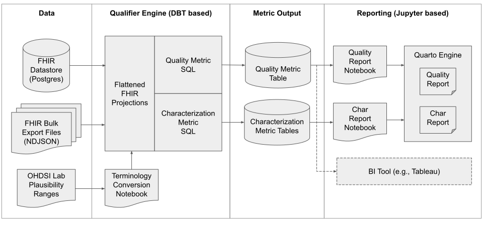

# Qualifier Reference Implementation

## Overview

> **Note** 
> This project under active development. Only a small subset of the planned metrics have been implemented to date, and existing code is likely to change over the next few months.

This is a reference implementation of the [Qualifier](../metrics.md) data quality and characterization metrics for FHIR datasets. It currently includes SQL implementations of a subset of the defined metrics, with support for data stored in a Postgres database (FHIR in a JSON or JSONB column, one table per resource type) or a directory of NDJSON files of FHIR resources (via the duckdb data engine, one file per resource type).

High level architecture:
<div></div>

## Setting up and running Qualifier

### Install prerequisites and clone this repository

1. Download and install [git](https://git-scm.com/downloads)

	If you'll be running Qualifier in a docker container, also download [docker desktop](https://www.docker.com/products/docker-desktop/)

2. Clone this repository and switch to the qualifier directory
	```
	git clone {repository path}
	cd qualifier/app
	```

### Configure Qualifier

#### Configure to run on NDJSON files of FHIR resources

If you won't be using the docker image to run Qualifier, update the `ndjson_file_path` variable in `dbt_project.yml` to reflect the location of your data (defaults to `../data/{name}.ndjson`). Note that `{name}` is a template string that will be replaced at runtime with the lowercase name of the resource being queried. You can also set your data location at runtime using the [`--vars parameter`](https://docs.getdbt.com/docs/build/project-variables#defining-variables-on-the-command-line).

Qualifier is currently structured to process a directory of ndjson files, with one file per FHIR resource type. File names should reflect the resource type name with an ndjson extensions (e.g. `patient.ndjson`),  though you can specify aliases to other file names by populating the `identifier` attribute for that table in the `models/sources.yml` file (https://docs.getdbt.com/docs/build/sources#faqs). To ensure that the characterization only runs for files that exist, delete or comment out table names not in your data set. Depending on how your data was exported, it may be necessary to convert FHIR bundles to FHIR bulk data format or consolidate multiple FHIR bulk data files into one file per FHIR resource type. 

#### Configure to run on Postgres database tables of FHIR resources

Qualifier currently expects your database to have one table for each FHIR resource type with a JSON or JSONB format column containing the FHIR resources. The table names should reflect the resource type name (e.g. `patient`), though you can specify aliases to other table names by populating the `identifier` attribute for that table in the `models/sources.yml` file (https://docs.getdbt.com/docs/build/sources#faqs). To ensure that the characterization only runs for tables that exist, delete or comment out table names not in your data set.

Update `profiles.yml` to reflect your [database connection settings](https://docs.getdbt.com/docs/get-started/connection-profiles) and be sure the `target` value in that file is set to the desired profile (this can also be passed in at runtime using the [`--vars parameter`](https://docs.getdbt.com/docs/build/project-variables#defining-variables-on-the-command-line)). If you intend to use the docker image of Qualifier and will be running a local instance of Postgres on the host machine, be sure to list `http://host.docker.internal` as the host address.

Update project variables in `dbt_project.yml`. Note that these can also be passed in at runtime using the [`--vars parameter`](https://docs.getdbt.com/docs/build/project-variables#defining-variables-on-the-command-line)

- `db_json_column` - reflects the name of the column with your FHIR data (it defaults to `json`).
- `db_is_jsonb` - indicates if this column is `json` or `jsonb` (defaults to `True`)

If you're going use Qualifier to generate reports, you'll also need to set an environment variable named `DB_CONNECTION_STRING` to a [SQLAlchemy connection url](https://docs.sqlalchemy.org/en/20/core/engines.html#database-urls) string for your database. You can also create a `.env` file in the `/reports` directory to set this variable in the form of `DB_CONNECTION_STRING={SQLAlchemy connection url}`.

### Install Qualifier

#### Build and launch with the docker image (recommended)

If you're planning to use install Qualifier locally you can skip this section.

After performing the install and configuration steps above, build the docker container by running the following command in the qualifier `app` directory to create an image named `qualifier`.

```
docker build -t qualifier .
```

Next, run the container, mounting an output directory for the quality and/or characterization reports as a docker volume. If you plan to using FHIR ndjson files as the data source, you'll need to also mount a data directory as a read only volume. No additional configuration should be required to connect to a Postgres instance running on the host machine. To connect from the docker container to a remote Postgres instance, please consult the docker documentation.

The following example runs the docker image, mounting a subdirectory of the current directory named `data` as the data source, mounting the current directory as the report output location, and opening a bash prompt for working with Qualifier.

```
docker run -it \
-v "$(pwd)/data/:/usr/app/data:ro" \
-v "$(pwd)/:/usr/app/report_output" \
qualifier bash
```

Once you've executed the desired Qualifier operations using the commands below, you can stop the container by typing `exit`.

#### Install Qualifier locally

If you're planning to use the docker container to run Qualifier, you can skip this section.

Download and install prerequisites:

- [python v3.7+](https://www.python.org/downloads/) 
- [quarto](https://quarto.org/docs/get-started/) and/or [jupyter](https://jupyter.org/install) for generating seed files and viewing output reports. Be sure to install a [PDF engine](https://quarto.org/docs/output-formats/pdf-engine.html) if you'd like to generate reports in PDF format.

Install the python packages to run dbt with the DuckDB and Postgres drivers:
```
pip3 install -r requirements-dbt.txt
```

Install the python packages to generate reports:
```
pip3 install -r requirements-jupyter.txt
```

Switch to the dbt directory:
```
cd dbt
```

### Run Qualifier

#### Create seed tables (only needs to be done on first run or when seeds files are changed)

``` 
dbt seed
```

#### Run metrics

Include the [parameters](https://docs.getdbt.com/reference/commands/run) that makes sense for your use case. For example:

- Generate all metrics:
	``` 
	dbt run
	```

- Clear historical metric results and generate metrics:
	```
	dbt run --full-refresh
	```

- Generate only quality metrics:
	``` 
	dbt run --select quality_metrics
	```

- Clear historical quality metric results and generate quality metrics:
	```
	dbt run --select quality_metrics --full-refresh
	```

- Generate only characterization metrics:
	```
	dbt run --select c_
	```

### Generate Reports

Quality metrics are added to a table named `quality_metrics`, while characterization metrics will be materialized as tables with the [name of the metric](../metrics.md). The `quality.ipynb` and `characterization.ipynb` notebooks query these tables and produce summary reports. The commands below use a tool named [quarto](https://quarto.org/docs/get-started/) to run these notebooks and convert their output to HTML and/or PDF reports.

These notebooks represent a starting point for reviewing Qualifier metrics, but you may wish to modify them to view stratifications of the data that aren't shown, or to tailor the visualizations to a particular use. The output tables can also be directly queried or exported with a SQL tool, or accessed from a business intelligence tool like Microsoft Power BI or Tableau. 

#### Generate the quality report as a html file (recommended)

```
quarto render ../reports/quality.ipynb \
--to html --execute
```

If you're running qualifier in a docker container, include the following at the end of the command to copy the generated file into your mounted volume:
```
&& mv ../reports/quality.html ../report_output/quality.html
```

#### Generate the characterization report as a html file (recommended)

```
quarto render ../reports/characterization.ipynb \
--to html --execute	
```

If you're running qualifier in a docker container, include the following at the end of the command to copy the generated file into your mounted volume:
```
&& mv ../reports/characterization.html ../report_output/characterization.html
```

#### Generate the quality report as a pdf (some tables may be cut off)

```
quarto render ../reports/quality.ipynb \
--to pdf --no-cache --execute
```

If you're running qualifier in a docker container, include the following at the end of the command to copy the generated file out into your mounted volume:
```
&& mv ../reports/quality.pdf ../report_output/quality.pdf
```

#### Generate the characterization report as a pdf

```
quarto render ../reports/characterization.ipynb \
--to pdf --no-cache --execute
```

If you're running qualifier in a docker container, include the following at the end of the command to copy the generated file out into your mounted volume:
```
&& mv ../reports/characterization.pdf ../report_output/characterization.pdf
```

## Implemented Metrics

- Quality
	- q_obs_value_range
	- q_obs_comp_value_range

- Characterization
	- c_resource_count (Patient, Observation, Condition, Encounter, Immunization, AllergyIntolerance, DocumentReference, MedicationRequest, Medication, MedicationAdministration, Device)
	- c_pt_count
	- c_pt_deceased_count
	- c_term_coverage

## Modifying Qualifier

### Refreshing or altering the clinical plausibility data

The project includes csv files of clinical plausibility definitions derived from the OHDSI OMOP Data Quality Dashboard in the `\seeds` directory. These files can be directly edited to expand or alter  the valid lab value ranges, the valid vital sign value ranges, and the gender specific conditions and procedures used to compute quality metrics. The files can also be regenerated to account for changes in the OMOP concept terminology mappings by running the `build-plausibility-seeds.ipynb` Jupyter notebook.

### Running metric unit tests

```
dbt test
```

### Code structure

- Directories
	- [/dbt/macros/flat-fhir](dbt/macros/flat-fhir/) - dbt macros to project FHIR json into "rectangular" relational models
	- [/dbt/macros/metric](dbt/macros/metric/) - dbt macros to compute quality and characterization metrics
	- [/dbt/macros/unit-tests](dbt/macros/unit-tests/) - unit tests for flat-fhir projections and metric calculation
	- [/dbt/macros/util](dbt/macros/util/) - dbt macros used to avoid repetition
	- [/dbt/models](dbt/models/) - thin wrappers over flat-fhir and metric macros to materialize tables
	- [/dbt/unit-tests](dbt/unit-tests/) - thin wrappers over unit tests to support the dbt test runner
	- [/reports](reports/) - jupyter notebooks to generate metric reports from computed metrics

- Configuration
	- [dbt_project.yml](dbt/dbt_project.yml) - project configuration
	- [profiles.yml](dbt/profiles.yml) - database connection configuration

- SQL Templates
	- [flat_patient](dbt/macros/flat-fhir/flat_patient.sql) ([unit tests](dbt/macros/unit-tests/flat_patient.sql)) -  projection of FHIR Patient resource
	- [flat_obs_quantitative.sql](dbt/macros/flat-fhir/flat_obs_quantitative.sql) ([unit tests](dbt/macros/unit-tests/flat_obs_quantitative.sql)) -  projection of FHIR Observation resource with valueQuantity populated
	- [flat_obs_quantitative_component.sql](dbt/macros/flat-fhir/flat_obs_quantitative_component.sql) ([unit tests](dbt/macros/unit-tests/flat_obs_quantitative_component.sql)) - projection of FHIR Observation resource with component.valueQuantity populated
	- [q_obs_value_range](dbt/macros/metric/q_obs_value_range.sql) ([unit tests](dbt/macros/unit-tests/q_obs_value_range.sql)) - quality metric calculation using flat_obs_quantitative or flat_obs_quantitative_component
	- [c_resource_count](dbt/macros/metric/c_resource_count.sql) ([unit tests](dbt/macros/unit-tests/c_resource_count.sql)) - characterization metric calculation for counts of resources by category and primary date (where applicable)
	- [c_pt_count](dbt/macros/metric/c_pt_count.sql) ([unit tests](dbt/macros/unit-tests/c_pt_count.sql)) - characterization metric calculation using flat_patient
	- [c_pt_deceased_count](dbt/macros/metric/c_pt_deceased_count.sql) ([unit tests](dbt/macros/unit-tests/c_pt_deceased_count.sql)) - characterization metric calculation using flat_patient
	- [c_term_coverage](dbt/macros/metric/c_term_coverage.sql) ([unit tests](dbt/macros/unit-tests/c_term_coverage.sql)) - characterization metric calculation
	- [expectations_to_metric](dbt/macros/util/expectations_to_metric.sql) ([unit tests](dbt/macros/unit-tests/expectations_to_metric.sql)) - aggregate quality metrics into standard structure of numerator, denominator and error examples

- Misc
	- [build-plausibility-seeds.ipynb](build-plausibility-seeds.ipynb) - jupyter notebook to adapt OHDSI data plausibility definitions for use in the q_obs_value_range metric
	- [table_to_sql](dbt/macros/util/table_to_sql.sql), [import_json](dbt/macros/util/import_json.sql), [compare_tables](dbt/macros/util/compare_tables.sql), [count_rows](dbt/macros/util/count_rows.sql) - jinja macros to support unit testing

- Reports
	- [quality.ipynb](reports/quality.ipynb) - jupyter notebook that produces a quality metric report 
	- [characterization.ipynb](reports/characterization.ipynb) - jupyter notebook that produces a characterization metric report